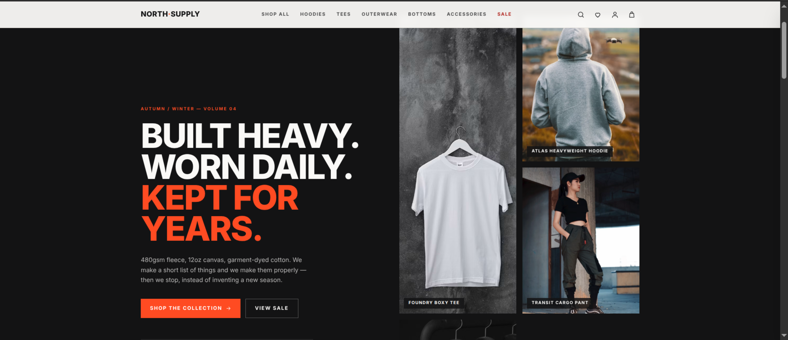

# NORTH SUPPLY

A complete PERN (PostgreSQL · Express · React · Node) storefront for a modern
unisex streetwear label — customer shop, accounts, checkout, and a full admin
back office.

## Preview



> **Payments are simulated.** Cards are validated (Luhn + expiry) and only the
> brand and last four digits are stored. Nothing is charged, and no PAN ever
> reaches the database. See "Going live" below for the Stripe swap.

## Live Demo

[Open NORTH SUPPLY](https://north-supply.onrender.com/)

> The demo uses simulated payments. No real payment is processed.

---

## Quick start

```bash
# 1. System dependencies (Ubuntu/Debian)
sudo apt update && sudo apt install -y nodejs npm postgresql postgresql-contrib

# 2. Create the database role + database
sudo -u postgres psql -f scripts/setup-db.sql

# 3. Install, migrate, seed
npm install
cp server/.env.example server/.env      # already done if you cloned this working tree
npm run db:migrate
npm run db:seed

# 4. Run both servers
npm run dev
```

| Service    | URL                     |
| ---------- | ----------------------- |
| Storefront | http://localhost:5173   |
| API        | http://localhost:4000   |
| Health     | http://localhost:4000/api/health |

Vite proxies `/api` to the backend, so the whole app is same-origin in
development and the httpOnly auth cookie works without CORS gymnastics.

### Demo credentials

| Role     | Email                    | Password      |
| -------- | ------------------------ | ------------- |
| Admin    | `admin@northsupply.test` | `admin1234`   |
| Customer | `jordan@example.com`     | `password123` |

Login is two-step: after the password you need the emailed six-digit code.
With no SMTP configured it is printed to the server console — look for
`[otp] login code for …`. Set `REQUIRE_LOGIN_OTP=false` in `server/.env` to skip
it while developing.

Other seeded customers: `sam@`, `rin@`, `alex@example.com` (same password).

### Promo codes

| Code        | Effect                       |
| ----------- | ---------------------------- |
| `WELCOME10` | 10% off, no minimum          |
| `SUPPLY25`  | 25% off orders over $200     |
| `FLAT20`    | $20 off orders over $120     |
| `EXPIRED5`  | Expired — for testing errors |

Test card: `4242 4242 4242 4242`, any future expiry, any CVC.

---

## What's in it

**Storefront**
- Homepage with featured pieces, category grid, and new arrivals
- Catalogue with full-text search, category / size / colour / price filters,
  sale and in-stock toggles, six sort orders, and pagination — all driven from
  the URL so every view is shareable and the back button behaves
- Product pages with per-colourway galleries, size × colour variant selection,
  live stock and low-stock warnings, related products, and customer reviews
- Slide-out cart with a free-shipping progress meter; cart persists in
  `localStorage` across sessions
- Checkout: contact → address → delivery method → payment, with server-priced
  totals, promo codes, and saved-address prefill
- Guest order tracking by order number + email
- Wishlist, order history, saved addresses, profile and password management
- **Self-service returns** — open an RMA from any shipped or delivered order,
  pick items and quantities, track its status; guests can too, via the email
  the order was placed under
- **Password reset** by emailed single-use link
- **Email OTP on sign-up and sign-in** — registration sends a six-digit code
  before the account is created at all, and password login is a second step
  behind another code
- **Sign in with Google** — one tap creates or links an account (opt-in; see
  below)
- Newsletter signup, size guide, FAQ, 404

**Admin** (`/admin`, admin role required)
- Dashboard: revenue / orders / customers / stock metrics, a 14-day revenue
  chart, recent orders, best sellers, and low-stock alerts
- Products: searchable table, create/edit in a slide-over with a variant matrix
  (size, colour, hex, stock), soft visibility and featured flags
- Orders: filter by status, expand for line items and shipping address, change
  fulfilment status inline
- Customers: order counts and lifetime value
- Promo codes: create percentage or fixed-amount codes with minimums, usage
  caps, and expiry
- Returns: filter by status, review the customer's reason, set a refund amount
  and a note, and move the RMA through its lifecycle — the customer is emailed
  on every status change, and marking one `received` puts the stock back on sale

---

## Architecture

```
clothing-store/
├── server/                     Express + TypeScript API
│   └── src/
│       ├── db/                 pool, schema.sql, migrate, seed
│       ├── lib/                env, errors, pricing engine, SVG image generator
│       ├── middleware/         auth (JWT cookie), error handling
│       └── routes/             auth, products, reviews, wishlist, addresses,
│                               orders/checkout, coupons, admin, images
└── client/                     React 18 + Vite + Tailwind v4
    └── src/
        ├── components/         Header, Footer, CartDrawer, ProductCard, ui kit
        ├── context/            Auth, Cart, Wishlist, Toast
        ├── lib/                fetch wrapper, formatters
        └── pages/              storefront, account, admin/
```

### Decisions worth knowing

**Prices are decided on the server, always.** The cart in `localStorage` holds
a display snapshot only. `POST /api/orders/quote` re-prices every line from the
database, and checkout re-prices again inside the transaction. A tampered client
cart changes nothing about what gets charged.

**Checkout is transactional.** `priceCart(..., { lock: true })` selects the
variant rows `FOR UPDATE`, so two shoppers racing for the last unit cannot both
succeed — the second is rejected with a real "just sold out" message rather than
overselling.

**Order items are denormalised.** Product name, slug, size, colour and unit
price are copied onto `order_items` at purchase time, so an old order still
reads correctly after the product is renamed, repriced, or deleted.

### Turning on real email

The store is wired for Gmail SMTP, which sends from your own Gmail account to
**any** recipient with no domain verification. `server/.env` has everything
except the password:

1. Turn on [2-Step Verification](https://myaccount.google.com/signinoptions/two-step-verification)
   — App Passwords do not exist without it.
2. Create an [App Password](https://myaccount.google.com/apppasswords) and copy
   the 16 characters.
3. Paste it into `server/.env` as `SMTP_PASSWORD=` (spaces are stripped for you,
   so `abcd efgh ijkl mnop` is fine). Your normal Gmail password will not work.
4. Restart the server, then check it: `npm run mail:test -- someone@example.com`.

Gmail allows roughly 500 messages a day, which is ample here but is not a
production mail strategy — move to a transactional provider before real
traffic. Any SMTP provider drops in by changing the five `SMTP_*` values.

`npm run mail:test` prints the active transport, sends one message, and decodes
the common failures (App Password missing, 2-Step Verification off, wrong
sender, unreachable host) instead of surfacing a raw SMTP code. The server also
logs its transport at boot:

```
[mail]   SMTP smtp.gmail.com:587 as "NORTH SUPPLY <you@gmail.com>"
[mail]   file outbox (no SMTP_HOST configured)
```

**Email works out of the box, with no credentials.** With `SMTP_HOST` unset,
[the mailer](server/src/lib/mailer.ts) writes each message as an `.html` file
into `server/.mail-outbox/` and logs the path, so every email path is runnable
and inspectable on a fresh clone. Set the SMTP variables and the same code
sends for real — nothing else changes.

A host without credentials also falls back to the file outbox rather than
failing every send silently, so a half-filled `.env` degrades instead of
breaking. When mail is not being delivered the sign-in UI says so outright
rather than claiming a code was emailed, and `GET /api/auth/config` reports
`mailDelivery: false`. Five templates live in
[emails.ts](server/src/lib/emails.ts): order confirmation, shipping
notification, password reset, return requested, and return status changed. All
are table-based with inline styles and ship a plain-text alternative.

Sending is fire-and-forget (`queue`, not `await send`): a paid order must not
fail because a mail server is down. A production build would put that on a real
queue with retries.

**Reviews require a verified purchase.** The product page advertises "verified
reviews", so [review.routes.ts](server/src/routes/review.routes.ts) checks the
customer actually has a paid order containing the product. The seed derives its
reviews from real order history for the same reason — otherwise it would create
data the API itself would reject.

**Returns restock exactly once.** Moving an RMA to `received` returns the units
to `product_variants.stock`; a `restocked_at` stamp makes that idempotent, so
flip-flopping the status cannot inflate inventory.

**Password resets don't leak account existence.** `/auth/forgot-password`
returns the same response whether or not the email has an account. Only a
SHA-256 of the token is stored, links are single-use, expire in an hour, and
issuing a new one invalidates any earlier link.

**Registration creates nothing until the code is confirmed.** The pending
signup — password hash and name — lives on the `otp_codes` row, not in `users`,
so an abandoned registration never squats an email address. Only a SHA-256 of
each six-digit code is stored; codes expire in ten minutes, are single-use,
allow five attempts before self-destructing, and issuing a new one kills the
old. `POST /auth/resend-code` only reissues when a challenge is genuinely
outstanding, so it cannot be used to mail arbitrary strangers.

Without SMTP configured, codes are also printed to the server console
(`[otp] login code for you@example.com: 481920`) — that is how you sign in
locally. Never in production.

**Google sign-in is off until you configure it.** With `GOOGLE_CLIENT_ID`
blank the button does not render and `POST /auth/google` returns 503. When set,
the client uses Google Identity Services and the server verifies the ID token's
signature, issuer, expiry and — critically — that `aud` is your own client id.
[resolveGoogleUser](server/src/lib/google.ts) then finds or creates the account:
a known `google_id` signs straight in, a matching email links to the existing
local account, and anything else creates a passwordless one. Linking by email is
only safe because the verifier rejects tokens whose address Google has not
itself verified; without that check, a token minted for any address could claim
the matching local account.

Because Google-created accounts have no local password, `users.password_hash` is
nullable and a `users_have_a_credential` CHECK guarantees every row still has at
least one way in. Password login against such an account returns a clear
"use Google instead" rather than a generic failure, and the account page offers
the reset flow to add a password.

**To enable Google sign-in:** create an OAuth client ID at
<https://console.cloud.google.com/apis/credentials> (type *Web application*,
authorised JavaScript origin `http://localhost:5173`), then put it in
`server/.env` as `GOOGLE_CLIENT_ID=…` and restart. Nothing else changes — the
client reads it from `GET /api/auth/config`, so it is configured in one place.

**Auth is an httpOnly cookie.** The JWT is never readable from JavaScript, which
blunts token theft via XSS. `optionalAuth` runs globally so routes can adapt to
a signed-in visitor without requiring one.

**Product photography comes from Unsplash.** The 20 seeded products carry 59
hand-picked photos, hotlinked from `images.unsplash.com` (Unsplash's own CDN,
which is how they ask to be embedded) and listed in
`server/src/db/productPhotos.ts` with photographer attribution that the product
page displays. All are under the Unsplash License — free commercial use,
attribution not required but given. Unsplash+ photos are deliberately excluded:
they cannot be hotlinked.

Two consequences worth knowing:

- **The catalogue needs an internet connection** to render images. Products with
  no entry in the photo manifest fall back to `server/src/lib/productImage.ts`,
  which draws a deterministic SVG garment silhouette per colourway — that path
  still covers anything you create in the admin without supplying URLs.
- **Photos are per product, not per colourway.** Stock imagery cannot honestly
  claim to show the Bone version of a garment photographed in grey, so selecting
  a colour changes the variant and the price, not the picture. Swap in real
  per-colour photography via the admin product editor and you can restore that
  link.

---

## Scripts

| Command              | What it does                                    |
| -------------------- | ----------------------------------------------- |
| `npm run dev`        | API and client together, both watching          |
| `npm run dev:server` | API only (tsx watch)                            |
| `npm run dev:client` | Vite only                                       |
| `npm run build`      | Type-check and build both workspaces            |
| `npm run db:migrate` | Drop and recreate every table from `schema.sql` |
| `npm run db:seed`    | Truncate and refill with the demo catalogue     |
| `npm run db:reset`   | Migrate then seed                               |
| `npm run mail:test -- you@example.com` | Send one email and diagnose the result |

`db:migrate` is destructive by design — it is a demo schema bootstrap, not an
incremental migration runner. For real deployments, put something like
`node-pg-migrate` or Prisma Migrate in front of it.

---

## Configuration

`server/.env` (copied from `.env.example`):

| Variable         | Default                          | Notes                              |
| ---------------- | -------------------------------- | ---------------------------------- |
| `DATABASE_URL`   | `postgresql://northsupply:…`     | Standard libpq connection string   |
| `PORT`           | `4000`                           | API port                           |
| `CLIENT_ORIGIN`  | `http://localhost:5173`          | CORS allowlist                     |
| `JWT_SECRET`     | dev placeholder                  | **Must** be changed in production  |
| `JWT_EXPIRES_IN` | `7d`                             | Session lifetime                   |
| `ADMIN_EMAIL`    | `admin@northsupply.test`         | Seeded admin account               |
| `ADMIN_PASSWORD` | `admin1234`                      | Seeded admin password              |
| `SMTP_HOST`      | `smtp.gmail.com`                 | Blank, or no credentials = write to disk |
| `SMTP_PORT` / `SMTP_SECURE` / `SMTP_USER` / `SMTP_PASSWORD` | — | Standard SMTP settings |
| `MAIL_FROM`      | `NORTH SUPPLY <orders@…>`        | Envelope sender                    |
| `MAIL_OUTBOX`    | `.mail-outbox`                   | Where the file transport writes    |
| `RETURN_WINDOW_DAYS` | `30`                         | How long a return stays open       |
| `PASSWORD_RESET_TTL_MINUTES` | `60`                 | Reset-link lifetime                |
| `OTP_TTL_MINUTES` | `10`                            | One-time code lifetime             |
| `OTP_MAX_ATTEMPTS` | `5`                            | Wrong guesses before a code dies   |
| `REQUIRE_LOGIN_OTP` | `true`                        | `false` skips the code on login    |
| `GOOGLE_CLIENT_ID` | *(blank)*                      | Blank disables Google sign-in      |

The server refuses to boot in production while still holding the development
`JWT_SECRET`.

---

## API surface

```
POST   /api/auth/register           POST   /api/auth/login
POST   /api/auth/logout             GET    /api/auth/me
PATCH  /api/auth/me                 POST   /api/auth/change-password
POST   /api/auth/forgot-password    POST   /api/auth/reset-password
GET    /api/auth/reset-password/:token
POST   /api/auth/verify-registration POST  /api/auth/verify-login
POST   /api/auth/resend-code        POST   /api/auth/google
GET    /api/auth/config

GET    /api/products                GET    /api/products/facets
GET    /api/products/:slug          GET    /api/products/:slug/related
GET    /api/products/:slug/reviews  GET    /api/categories

POST   /api/reviews                 DELETE /api/reviews/:id
GET    /api/reviews/eligibility/:productId
GET    /api/returns                 POST   /api/returns
GET    /api/returns/eligibility/:orderNumber
GET    /api/wishlist                POST   /api/wishlist
DELETE /api/wishlist/:productId
GET    /api/addresses               POST   /api/addresses
PUT    /api/addresses/:id           DELETE /api/addresses/:id

POST   /api/orders/quote            POST   /api/orders
GET    /api/orders                  GET    /api/orders/:orderNumber
POST   /api/coupons/validate        POST   /api/newsletter

GET    /api/admin/stats             GET    /api/admin/products
POST   /api/admin/products          PUT    /api/admin/products/:id
DELETE /api/admin/products/:id      PATCH  /api/admin/variants/:id/stock
GET    /api/admin/orders            PATCH  /api/admin/orders/:id/status
GET    /api/admin/returns           PATCH  /api/admin/returns/:id
GET    /api/admin/customers         GET    /api/admin/coupons
POST   /api/admin/coupons           DELETE /api/admin/coupons/:id

GET    /api/images/:slug.svg        GET    /api/health
                                    (generated placeholder art)
```

---

## Going live

This is a demo build. Before it handles real money or real customers:

1. **Payments.** Replace the simulated block in `server/src/routes/order.routes.ts`
   with a Stripe PaymentIntent: create the intent from the server-computed total,
   confirm it client-side, and only write the order on `payment_intent.succeeded`
   via webhook. The pricing engine already returns exactly the amount to charge.
2. **Secrets.** Generate a real `JWT_SECRET` (32+ random bytes) and keep it out
   of version control.
3. **Migrations.** Swap the drop-and-recreate `db:migrate` for a real migration
   tool before any data matters.
4. **Email.** Point `SMTP_HOST` at a real provider (the file-outbox transport is
   a development convenience, not a fallback you want in production), and move
   sending onto a queue with retries and a dead-letter path.
5. **Images.** Move photography onto your own CDN rather than hotlinking
   Unsplash, and add a file-upload path to the admin product editor (it takes
   URLs today, not uploads). The helmet CSP in `server/src/index.ts` allowlists
   `images.unsplash.com` for `img-src` — update it when the host changes.
6. **Rate limiting.** Only the auth routes are rate-limited today; extend it to
   checkout and review posting.
